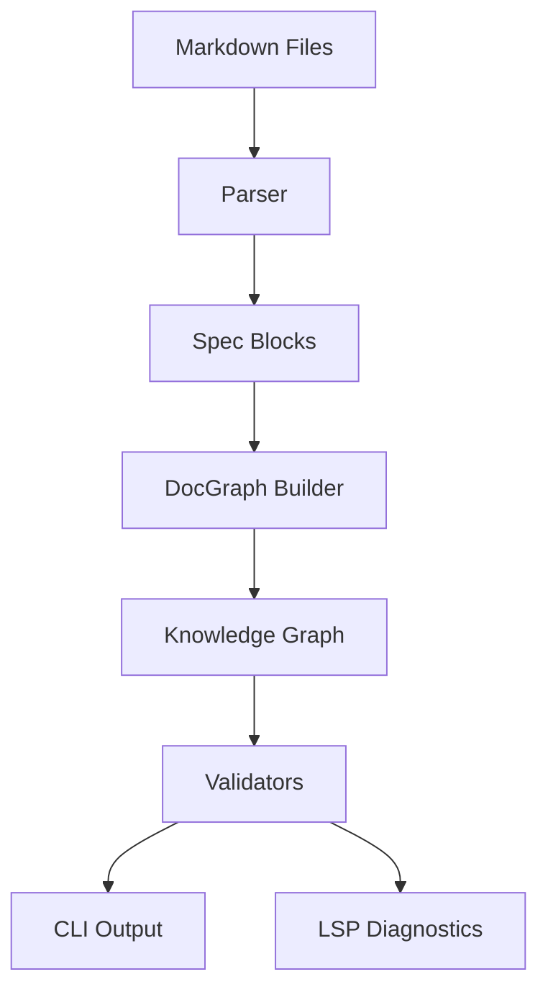

# Architecture Overview

`docgraph` is designed to be a modular tool for building and validating knowledge graphs from Markdown files.

## High-Level Design

The system is architected to separate the data extraction (parsing), graph modeling, and the user interface (CLI/LSP).

## Key Components

### 1. Core Logic (`src/core/`)

- **Parser**: Extracts `{document}` blocks and SpecBlocks (ID + Heading) from Markdown.
- **DocGraph**: A structural representation of documents (nodes) and their relationships (edges).
- **Rules**: A set of validation rules (e.g., `DG001` - `DG006`) that are applied to the graph.

### 2. CLI (`src/cli/`)

The CLI provides a user-friendly interface to the core logic. It handles command-line arguments (using `clap`) and formats results for console display.

### 3. Language Server (`src/lsp/`)

Implemented using `tower-lsp`, this component provides interactive features to editors. It maintains a workspace-wide index to provide real-time feedback.

## Data Flow: The `check` Command

1. **Walk**: Recursively find all `.md` files in the target directory.
2. **Collect**: Parse each file to extract SpecBlocks and links.
3. **Build**: Construct a `DocGraph` from the collected data.
4. **Lint**: Run the validation engine against the graph.
5. **Report**: Output diagnostics to the user.
