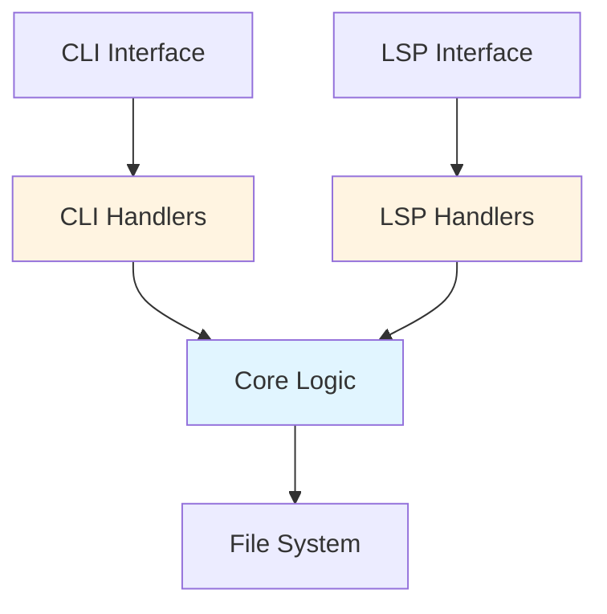

<a id="CC_LAYERED_ARCH"></a>

# Cross-Cutting Concept: Layered Architecture

## Overview

`docgraph` adopts a **3-layer architecture** to clearly separate business logic from user interfaces, ensuring maintainability and extensibility.

## Architecture Layers



### Layer 1: Core (`src/core/`)

**Responsibility**: Implementation of domain logic and business rules

**Key Modules**:

- `parse.rs`: Structure extraction from Markdown files
- `collect.rs`: Block collection across workspace
- `lint.rs`: Validation engine orchestration
- `config.rs`: Configuration file loading and management
- `walk.rs`: File system traversal
- `rules/`: Validation rules (DG001-DG006)
- `types.rs`: Common data types (`SpecBlock`, `Diagnostic`, etc.)

**Characteristics**:

- Independent of interfaces
- Implemented as pure functions, easy to test
- Used by both CLI and LSP

### Layer 2: CLI Handlers (`src/cli/handlers/`)

**Responsibility**: CLI command processing and console output formatting

**Key Modules**:

- `check.rs`: `docgraph check` command processing
- `rule.rs`: `docgraph rule` command processing
- `graph.rs`: `docgraph graph` command processing
- `list.rs`: `docgraph list` command processing
- `trace.rs`: `docgraph trace` command processing
- `describe.rs`: `docgraph describe` command processing
- `common.rs`: Common utilities (`glob_to_regex`, `print_diagnostics`)

**Data Flow**:

```text
User Input (args) → Handler → Core Logic → Handler → Console Output
```

### Layer 3: LSP Handlers (`src/lsp/handlers/`)

**Responsibility**: LSP protocol request processing and response generation

**Key Modules**:

- `completion.rs`: Auto-completion feature
- `definition.rs`: Jump to definition feature
- `hover.rs`: Hover information display
- `references.rs`: Reference search
- `rename.rs`: Rename feature
- `call_hierarchy.rs`: Call hierarchy display

**Data Flow**:

```text
LSP Request → Handler → Core Logic → Handler → LSP Response
```

## Related

- [ADR_LAYERED_ARCH (Layered Architecture: Core, CLI Handlers, LSP Handlers)](../../decisions/layered-architecture.md#ADR_LAYERED_ARCH)
