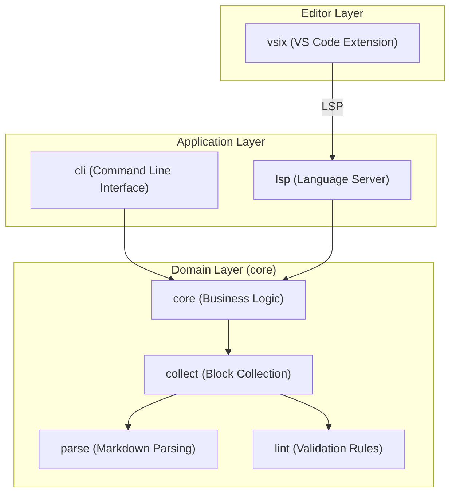

# Module View

The `docgraph` project is organized into several distinct modules, separating the core domain logic, the command-line
interface, the language server, and the editor integration.

## Module Structure Overview

### Core Library

The `core` module contains the fundamental logic for analyzing documentation graphs.

- **`types`**: Defines the data structures for `Node`, `RefUse`, and `Graph`.
- **`parse`**: Responsible for extracting `{document}` blocks and HTML anchors from Markdown files.
- **`collect`**: Orchestrates the scanning of directories and aggregation of nodes.

### Validation Rules

- **`lint`**: Implements the validation engine and individual rules (DG001-DG006).

### Graph Logic

- **`graph`**: Manages the construction and traversal of the dependency graph.

### Error Definitions

- **`error`**: Defines the unified error types and handling strategies.

### CLI Application

The `cli` module handles user interaction via the terminal.

- **`handlers`**: Contains the logic for each CLI command (`check`, `list`, `describe`, `graph`, `trace`, `rule`).
- **`output`**: Manages the formatting of results (Text, JSON).

### LSP Library

The `lsp` module provides the Language Server Protocol implementation.

### LSP Server

- **`server`**: Implements the main event loop and lifecycle management.

### LSP Handlers

- **`handlers`**: Implements LSP capabilities such as `textDocument/definition`, `textDocument/references`, and
  `textDocument/hover`.

### VS Code Extension

The `vsix` module is a TypeScript-based project that acts as the LSP client.

- **`src/extension.ts`**: Manages the lifecycle of the `docgraph` language server and registers editor-specific
  commands.

### Zed Editor Extension

The `zed-extension` is a WASM-based extension for the Zed editor.

- **`zed-extension/src/lib.rs`**: Implements the `zed::Extension` trait and the `language_server_command` to bridge Zed
  and the `docgraph` binary.

### CI/CD Pipelines

The `.github` directory contains the CI/CD pipeline configuration.

- **`.github/workflows/ci.yml`**: Automated validation and testing on pull requests.
- **`.github/workflows/codeql.yml`**: Static application security testing.
- **`.github/dependabot.yml`**: Automated dependency updates.

### Claude Code Plugin

The `docgraph-plugin` provides a Model Context Protocol (MCP) server for Claude Code.

- **`skills/docgraph`**: Defines the tools and resources available to the AI agent.
- **`.claude-plugin`**: Contains the plugin manifest and capability definitions.

### Dev Container

The `.devcontainer` directory contains the development environment configuration.

- **`devcontainer.json`**: Defines the container image, features, and tool installations.
- **`postCreateCommand`**: Installs additional tools (docgraph, Claude Code).
- **Extensions**: Pre-configured VS Code extensions for Rust, TOML, debugging, and AI assistance.

### Test Infrastructure

The `tests` directory and test utilities.

- **`tests/`**: Integration and E2E tests.
- **`src/test_utils`**: Helper functions and mocks for testing.
