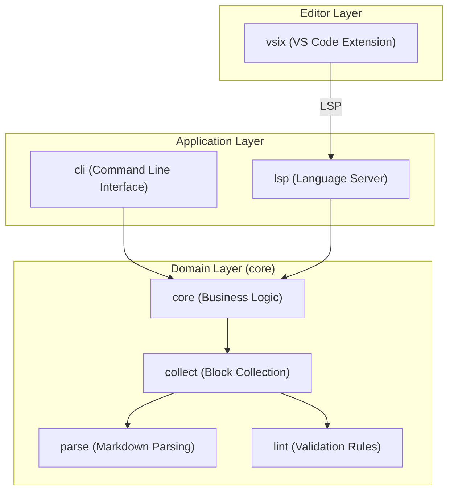

# Module View

The `docgraph` project is organized into several distinct modules, separating the core domain logic, the command-line interface, the language server, and the editor integration.

## Module Structure Overview

## Core Modules

The `core` module contains the fundamental logic for analyzing documentation graphs.

- **`types`**: Defines the data structures for `SpecBlock`, `RefUse`, and `Graph`.
- **`parse`**: Responsible for extracting `{document}` blocks and HTML anchors from Markdown files.
- **`collect`**: Orchestrates the scanning of directories and aggregation of spec blocks.
- **`lint`**: Implements the validation engine and individual rules (DG001-DG006).

## CLI Modules

The `cli` module handles user interaction via the terminal.

- **`handlers`**: Contains the logic for each CLI command (`check`, `list`, `describe`, `graph`, `trace`, `rule`).
- **`output`**: Manages the formatting of results (Text, JSON).

## LSP Modules

The `lsp` module provides the Language Server Protocol implementation.

- **`handlers`**: Implements LSP capabilities such as `textDocument/definition`, `textDocument/references`, and `textDocument/hover`.

## VS Code Extension

The `vsix` module is a TypeScript-based project that acts as the LSP client.

- **`src/extension.ts`**: Manages the lifecycle of the `docgraph` language server and registers editor-specific commands.

## Tests

Integration and E2E tests are located in the `tests/` directory, verifying the end-to-end functionality of both the CLI and properties of the core library.
