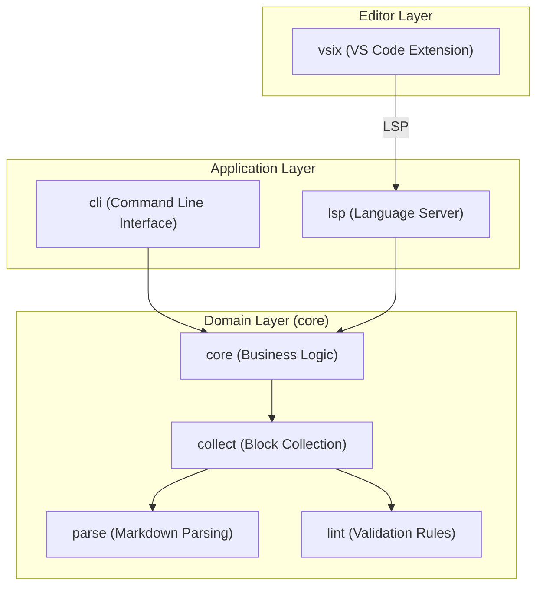

# Module View

The `docgraph` project is organized into several distinct modules, separating the core domain logic, the command-line
interface, the language server, and the editor integration.

## Module Structure Overview

### Core Library

The `core` module contains the fundamental logic for analyzing documentation graphs.

- **`types`**: Defines the data structures for `Node`, `RefUse`, and `Graph`.
- **`parse`**: Responsible for extracting `{document}` blocks and HTML anchors from Markdown files.
- **`collect`**: Orchestrates the scanning of directories and aggregation of nodes.

### Realizes

- [FR_CORE_VALID_REF (Valid References)](../../requirements/functional/core.md#FR_CORE_VALID_REF)
- [FR_CORE_UNIQUE (Unique Node IDs)](../../requirements/functional/core.md#FR_CORE_UNIQUE)
- [FR_CORE_AUDIT (Audit Logging)](../../requirements/functional/core.md#FR_CORE_AUDIT)
- [FR_CORE_AUTH (Authentication)](../../requirements/functional/core.md#FR_CORE_AUTH)
- [FR_CORE_TEMPLATE_VALIDATION (Template Validation)](../../requirements/functional/core.md#FR_CORE_TEMPLATE_VALIDATION)
- [FR_CORE_CONFIGURATION (Configuration)](../../requirements/functional/core.md#FR_CORE_CONFIGURATION)
- [NFR_AVAILABILITY (System Availability)](../../requirements/non-functional/performance.md#NFR_AVAILABILITY)
- [IF_CONFIG (docgraph.toml Configuration)](../../requirements/interfaces/interfaces.md#IF_CONFIG)

### Validation Rules

- **`lint`**: Implements the validation engine and individual rules (DG001-DG006).

### Realizes

- [FR_CORE_TEMPLATE_VALIDATION (Template Validation)](../../requirements/functional/core.md#FR_CORE_TEMPLATE_VALIDATION)

### Graph Logic

- **`graph`**: Manages the construction and traversal of the dependency graph.

### Realizes

- [FR_CORE_VALID_REF (Valid References)](../../requirements/functional/core.md#FR_CORE_VALID_REF)
- [FR_CORE_UNIQUE (Unique Node IDs)](../../requirements/functional/core.md#FR_CORE_UNIQUE)

### Error Definitions

- **`error`**: Defines the unified error types and handling strategies.

### Realizes

- [CC_ERROR_HANDLING (Error Handling Strategy)](../design/error-handling.md#CC_ERROR_HANDLING)

### CLI Application

The `cli` module handles user interaction via the terminal.

- **`handlers`**: Contains the logic for each CLI command (`check`, `describe`, `graph`, `rule`).
- **`output`**: Manages the formatting of results (Text, JSON).

### Realizes

- [FR_CLI_LINT (Lint Command)](../../requirements/functional/cli.md#FR_CLI_LINT)
- [FR_CLI_GRAPH (Graph Command)](../../requirements/functional/cli.md#FR_CLI_GRAPH)
- [FR_CLI_LIST (List Capability)](../../requirements/functional/cli.md#FR_CLI_LIST)
- [FR_CLI_TRACE (Trace Capability)](../../requirements/functional/cli.md#FR_CLI_TRACE)
- [FR_CLI_DESCRIBE (Describe Command)](../../requirements/functional/cli.md#FR_CLI_DESCRIBE)
- [FR_CLI_TYPE (Type Command)](../../requirements/functional/cli.md#FR_CLI_TYPE)
- [FR_CLI_VERSION (Version Command)](../../requirements/functional/cli.md#FR_CLI_VERSION)
- [FR_CLI_HELP (Help Command)](../../requirements/functional/cli.md#FR_CLI_HELP)
- [FR_CLI_QUERY (Query Command)](../../requirements/functional/cli.md#FR_CLI_QUERY)
- [FR_INSTALL_MANUAL (Manual Installation)](../../requirements/functional/installation.md#FR_INSTALL_MANUAL)
- [FR_INSTALL_BINARY (Binary Installation Support)](../../requirements/functional/installation.md#FR_INSTALL_BINARY)
- [FR_INSTALL_PREK (Pre-commit Hook Support)](../../requirements/functional/installation.md#FR_INSTALL_PREK)
- [IF_CLI (Command Line Interface)](../../requirements/interfaces/interfaces.md#IF_CLI)

### LSP Library

The `lsp` module provides the Language Server Protocol implementation.

### Realizes

- [FR_LSP_GOTO (Go to Definition)](../../requirements/functional/lsp.md#FR_LSP_GOTO)
- [FR_LSP_HOVER (Hover Information)](../../requirements/functional/lsp.md#FR_LSP_HOVER)
- [FR_LSP_COMP (Auto-completion)](../../requirements/functional/lsp.md#FR_LSP_COMP)
- [FR_LSP_REFS (Find References)](../../requirements/functional/lsp.md#FR_LSP_REFS)
- [FR_LSP_RENAME (Symbol Rename)](../../requirements/functional/lsp.md#FR_LSP_RENAME)
- [FR_LSP_HIERARCHY (Call Hierarchy)](../../requirements/functional/lsp.md#FR_LSP_HIERARCHY)
- [FR_LSP_DOC_SYMBOL (Document Symbol)](../../requirements/functional/lsp.md#FR_LSP_DOC_SYMBOL)
- [FR_LSP_WS_SYMBOL (Workspace Symbol)](../../requirements/functional/lsp.md#FR_LSP_WS_SYMBOL)
- [FR_LSP_SUPPORT (LSP Server)](../../requirements/functional/lsp.md#FR_LSP_SUPPORT)
- [NFR_LATENCY (System Latency)](../../requirements/non-functional/performance.md#NFR_LATENCY)
- [CC_COVERAGE (3. Code Coverage Standards)](../design/testing.md#CC_COVERAGE)

### LSP Server

- **`server`**: Implements the main event loop and lifecycle management.

### Realizes

- [FR_LSP_SUPPORT (LSP Server)](../../requirements/functional/lsp.md#FR_LSP_SUPPORT)

### LSP Handlers

- **`handlers`**: Implements LSP capabilities such as `textDocument/definition`, `textDocument/references`, and
  `textDocument/hover`.

### Realizes

- [CC_THIN_HANDLERS (Thin Handlers Pattern)](../design/thin-handlers.md#CC_THIN_HANDLERS)

### VS Code Extension

The `vsix` module is a TypeScript-based project that acts as the LSP client.

- **`src/extension.ts`**: Manages the lifecycle of the `docgraph` language server and registers editor-specific
  commands.

### Realizes

- [FR_VSC_LSP_CLIENT (LSP Client Integration)](../../requirements/functional/vscode.md#FR_VSC_LSP_CLIENT)
- [FR_VSC_BINARY_PATH (Binary Path Configuration)](../../requirements/functional/vscode.md#FR_VSC_BINARY_PATH)
- [FR_VSC_MARKDOWN_ACTIVATION (Markdown Activation)](../../requirements/functional/vscode.md#FR_VSC_MARKDOWN_ACTIVATION)
- [FR_VSC_SERVER_LIFECYCLE (Server Lifecycle Commands)](../../requirements/functional/vscode.md#FR_VSC_SERVER_LIFECYCLE)
- [NFR_VSCODE_PORTABILITY (Cross-platform Portability)](../../requirements/non-functional/vscode.md#NFR_VSCODE_PORTABILITY)
- [NFR_VSCODE_PACKAGING (Lightweight Packaging)](../../requirements/non-functional/vscode.md#NFR_VSCODE_PACKAGING)

### Zed Editor Extension

The `zed-extension` is a WASM-based extension for the Zed editor.

- **`zed-extension/src/lib.rs`**: Implements the `zed::Extension` trait and the `language_server_command` to bridge Zed
  and the `docgraph` binary.

### Realizes

- [FR_INSTALL_EXT_ZED (Zed Editor Extension)](../../requirements/functional/installation.md#FR_INSTALL_EXT_ZED)
- [IF_ZED_UI (Zed UI)](../../requirements/interfaces/interfaces.md#IF_ZED_UI)

### CI/CD Pipelines

The `.github` directory contains the CI/CD pipeline configuration.

- **`.github/workflows/ci.yml`**: Automated validation and testing on pull requests.
- **`.github/workflows/codeql.yml`**: Static application security testing.
- **`.github/dependabot.yml`**: Automated dependency updates.

### Realizes

- [FR_DEV_CI (Automated Validation)](../../requirements/functional/development.md#FR_DEV_CI)
- [FR_DEV_STANDARDS (Development Standards)](../../requirements/functional/development.md#FR_DEV_STANDARDS)
- [CC_CICD (CI/CD Pipeline)](../design/cicd.md#CC_CICD)
- [CC_CONVENTIONAL_COMMITS (Commit Messages)](../design/development-norm.md#CC_CONVENTIONAL_COMMITS)
- [CC_SEMANTIC_VERSIONING (Versioning)](../design/development-norm.md#CC_SEMANTIC_VERSIONING)

### Claude Code Plugin

The `docgraph-plugin` provides a Model Context Protocol (MCP) server for Claude Code.

- **`skills/docgraph`**: Defines the tools and resources available to the AI agent.
- **`.claude-plugin`**: Contains the plugin manifest and capability definitions.

### Realizes

<!-- Implements the plugin interface -->

- [IF_CLAUDE_CODE (Interface: Claude Code Plugin)](../../requirements/interfaces/interfaces.md#IF_CLAUDE_CODE)

### Dev Container

The `.devcontainer` directory contains the development environment configuration.

- **`devcontainer.json`**: Defines the container image, features, and tool installations.
- **`postCreateCommand`**: Installs additional tools (docgraph, Claude Code).
- **Extensions**: Pre-configured VS Code extensions for Rust, TOML, debugging, and AI assistance.

### Realizes

- [CC_DEV_ENV (Development Environment)](../design/development-norm.md#CC_DEV_ENV)

### Test Infrastructure

The `tests` directory and test utilities.

- **`tests/`**: Integration and E2E tests.
- **`src/test_utils`**: Helper functions and mocks for testing.

### Realizes

- [CC_TESTING_STRATEGY (Testing Strategy)](../design/testing.md#CC_TESTING_STRATEGY)
