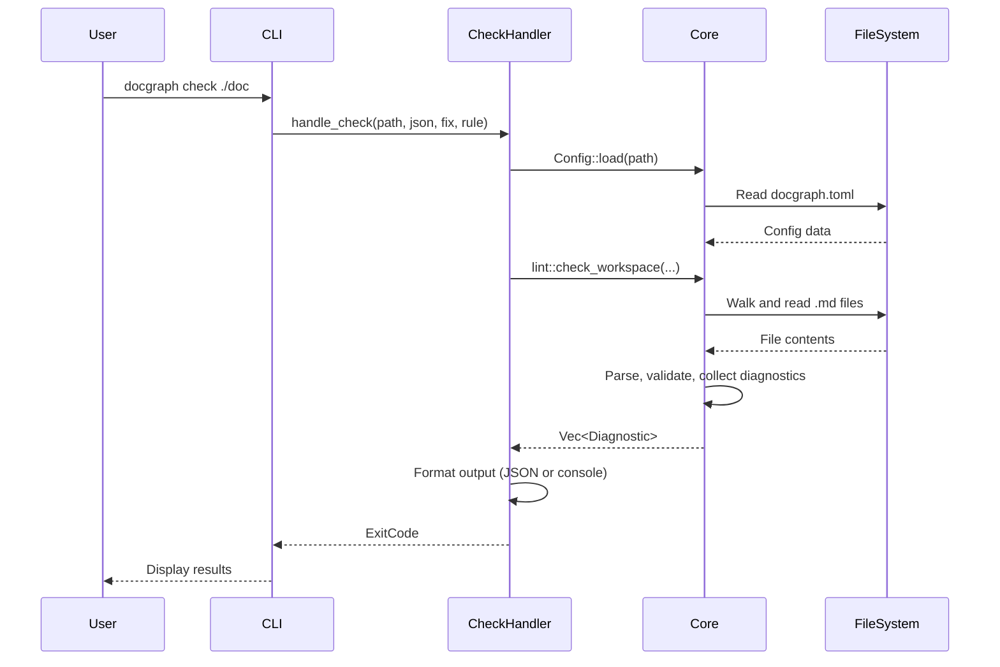

<a id="ADR_LAYERED_ARCH"></a>

# Layered Architecture: Core, CLI Handlers, LSP Handlers

## Status

Accepted

## Context

`docgraph` is a tool for building and validating knowledge graphs from Markdown files. It needs to support multiple interfaces (CLI, LSP) while sharing the same core logic, avoiding code duplication, and maintaining high maintainability.

## Decision

We adopt a 3-layer architecture:

1. **Core Layer** (`src/core/`)
   - Contains business logic and domain models
   - Pure logic independent of interfaces

2. **CLI Handlers** (`src/cli/handlers/`)
   - Handles CLI command processing
   - Calls Core logic and formats console output

3. **LSP Handlers** (`src/lsp/handlers/`)
   - Handles LSP protocol request processing
   - Calls Core logic and formats LSP responses

## Rationale

### 1. Separation of Concerns

- **Core**: Focuses on domain logic (parsing, validation, graph building)
- **Handlers**: Focuses on bridging user interfaces

#### 2. Reusability

- CLI and LSP share the same Core logic
- Adding new interfaces (e.g., Web API) requires no Core changes

#### 3. Testability

- Core logic is independent of I/O and can be unit tested as pure functions
- Handlers are thin layers verified through integration tests

Example of independent Core testing:

```rust
#[test]
fn test_parse_spec_block() {
    let content = r#"<a id="TEST_01"></a>
# Test Heading"#;
    let blocks = parse::extract_spec_blocks(content);
    assert_eq!(blocks.len(), 1);
}
```

#### 4. Maintainability

- Each handler is separated into its own file, making change impact clear
- Examples: `check.rs`, `rule.rs`, `graph.rs`, `list.rs`, `trace.rs`, `describe.rs`

#### 5. Dependency Rule

The architecture enforces a strict dependency rule: **dependencies always point inward toward Core**.

```text
CLI Handlers → Core ← LSP Handlers
```

This provides:

- **Interface Flexibility**: New interfaces can be added without modifying Core (e.g., `src/api/handlers/`, `src/github/handlers/`)
- **Change Isolation**: UI changes don't affect business logic (changing CLI output format only modifies `src/cli/handlers/`)
- **Core Stability**: Core validation logic remains stable across interface changes

## Consequences

### Positive

- **Maintainability**: Each layer's responsibility is clear, change impact is limited
- **Testability**: Core logic is independent of I/O and can be unit tested; handlers are thin and sufficient for integration testing
- **Extensibility**: Adding new interfaces (e.g., Web API) requires no Core changes; adding new commands or LSP features is easy
- **Reusability**: CLI and LSP share the same Core logic, code duplication is minimized

#### Negative

- Small changes may require modifications to multiple files
- New developers may need time to understand the file structure

## Example: `check` Command Flow

The following diagram illustrates how the layered architecture works in practice:



This flow demonstrates:

1. **Thin Handler**: `CheckHandler` only transforms inputs/outputs
2. **Core Independence**: Core has no knowledge of CLI
3. **Reusability**: The same `lint::check_workspace` could be called from LSP or any other interface

## Related

- [ADR_MARKDOWN_FORMAT (Choice of Plain Markdown and HTML Anchors)](file:///Users/sonesuke/Desktop/docgraph/doc/decisions/markdown-format.md#ADR_MARKDOWN_FORMAT)
